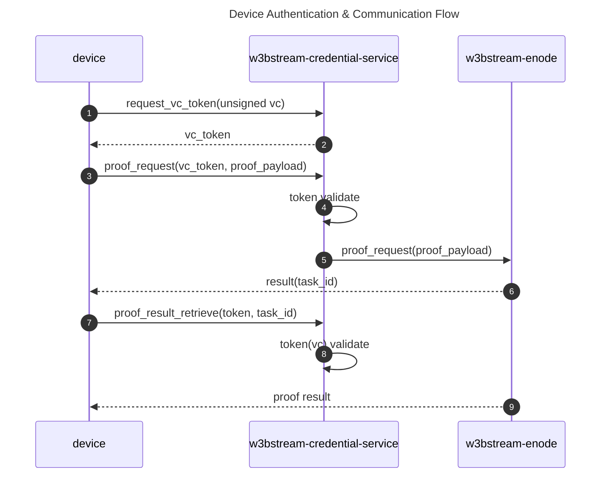

```mermaid
sequenceDiagram
title Device Authentication & Communication Flow
autonumber
device ->> w3bstream-credential-service: request_vc_token(unsigned vc)
w3bstream-credential-service -->> device: vc_token
device ->> w3bstream-credential-service: proof_request(vc_token, proof_payload)
w3bstream-credential-service ->> w3bstream-credential-service: token validate
w3bstream-credential-service ->> w3bstream-enode: proof_request(proof_payload)
w3bstream-enode -->> device: result(task_id)
device ->> w3bstream-credential-service: proof_result_retrieve(token, task_id)
w3bstream-credential-service ->> w3bstream-credential-service: token(vc) validate
w3bstream-enode -->> device: proof result
```